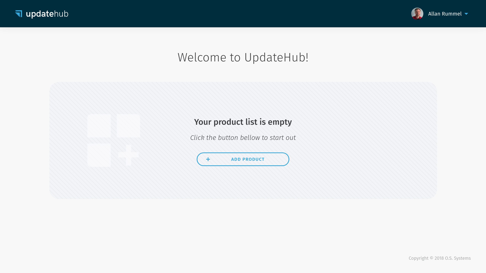
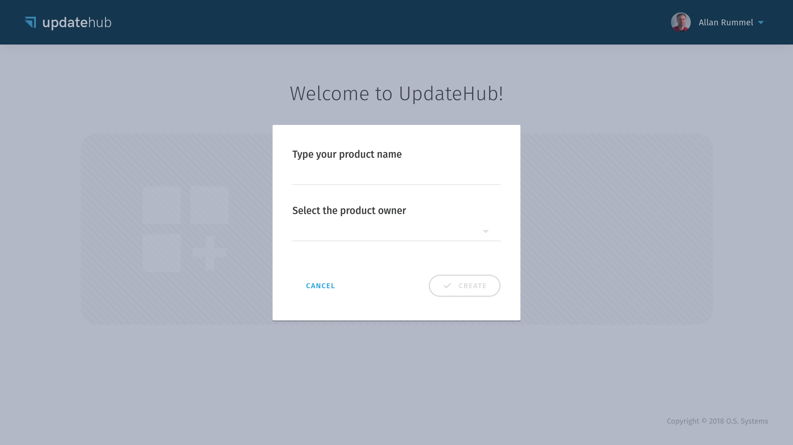

# Quick starting with RaspberryPi 3

This guide will help you to get started with **UpdateHub** by
supporting you to keep all your products up-to-date in a simple way
and at a lower cost.

We seek to use a simple and understandable language for any type of
user, from a technician to someone who is just starting. In this
step-by-step we show like easily you can generate a **Linux** image that
has **UpdateHub** support using **Yocto Project** in a **Raspberry Pi 3**
development board, and how easily you can update the whole system
**UpdateHub**.

!!! warning "Important" 
	Before starting this tutorial, check if your host **Linux** 	distribution is compatible and has all the dependencies required by **Yocto Project**, you can consult this	information at [Yocto Project Manual](https://www.yoctoproject.org/docs/3.0/mega-manual/mega-manual.html#required-packages-for-the-build-host).

## What You Will Need

To follow this guide, you will need the following:

* A **Raspberry Pi 3** [Model B](https://www.raspberrypi.org/products/raspberry-pi-3-model-b/)
or [B+](http://www.raspberrypi.org/products/raspberry-pi-3-model-b-plus/).
* An 4 GB or larger micro SD card.
* An Ethernet cable for wired connectivity to the internet.
* An [UpdateHub account](https://auth.updatehub.io/auth/signup/) to access the
hosted server.

!!! info "Information"
	An **UpdateHub** account allows manager even 5 devices; for more support and features is advisable migrate your plan. For more details click [here](https://updatehub.io/pricing/#pricing).

We assume that you have a previous experience with the **Yocto Project**, know the
main terms and already build an image using it.

## Preparing the Yocto Project environment

The first step is initialize the environment to build a **Linux** image
using **Yocto Project**. To start to work with **Yocto Project** we
need to fetch all the needed layers, that includes the **poky**,
*meta-openembedded*, *meta-raspberrypi*, *meta-updatehub* and
*meta-updatehub-raspberrypi* layers. The
[meta-updatehub](https://github.com/UpdateHub/meta-updatehub) is the
layer that adds support to **UpdateHub** itself, and
[meta-updatehub-raspberrypi](https://github.com/UpdateHub/meta-updatehub-raspberrypi)
includes **UpdateHub** support for **Raspberry Pi** machines. We need to get
the *meta-openembedded* layer because **UpdateHub** has some
dependencies, like **Python 3** packages to build the
[uhu](https://github.com/UpdateHub/uhu) utility that is used to manage
**UpdateHub** packages and will be cover in this guide.

To get the platform you need to have repo installed and use it as:

Install the *repo* utility:
``` shell
mkdir ~/bin
curl http://commondatastorage.googleapis.com/git-repo-downloads/repo > ~/bin/repo
chmod a+x ~/bin/repo
```
Download the platform source:
```
PATH=${PATH}:~/bin
mkdir updatehub-get-started
cd updatehub-get-started
repo init -u https://github.com/fbertux/updatehub-yocto-project-get-started.git
repo sync
```
At the end of the commands you have every metadata you need to start work with.

Setup the environment:
```
source ./setup-environment build
```
At the end of the commands you have every metadata you need to start work with.

## Creating a product

After you login in [UpdateHub](https://auth.updatehub.io/auth/login/) in the
*Products* page click *Add Product*.



By doing that the following dialog will be displayed. You should choose a
*Product* name and who will have control over it by choosing the *Owner* of the
product.



After the *Product* has been created a *Unique Identifier Number* is generated
to identify it. This number, should be added to your build in order to allow the
**UpdateHub** agent, which runs inside the target device, to communicate with
the **UpdateHub Cloud**.

For convenience, you can add the *UPDATEHUB_PRODUCT_UID* to your
*../build/conf/local.conf* configuration file when prototyping. However, as this
is a information that will be permanent for the whole product life cycle, it
should be put inside your distribution configuration file, or image recipe.

The *UPDATEHUB_PRODUCT_UID* will be shown to you when you create your product
inside the management server. It will look as:

```
UPDATEHUB_PRODUCT_UID = "05344b71c3e9f8..."
```

In case you didn't copy the *Product Unique Identifier Number* in the moment
that you create it on the **UpdateHub Cloud** don't worry. To get access to this
information again you must click on the *Product* icon and the *Unique
Identifier Number* will be shown to you.

Once you have logged in, the *Products* page will display the list of your own
products and the other products you have access to.


## Access Key

To authenticate and authorize requests for a project build with the
**UpdateHub Cloud** you must have a security credential in the form of an application
access key. Each access key is specific to your user and is used to upload the
packages update or any other external integration which needs to access the
**UpdateHub** API.

In order to generate an *Access Key* you must enter the *Settings* menu and click
on the *+ Request Access Key* button. Choose a name for the key and select the
API Key owner as *Me*.

Once the *Access Key* is created a dialog will appear to show the security
credentials. On the moment that this window is closed the keys will not be
showed again and if you lose them you must revoke the *Access Key* and generate a
new one.


Include the two variables in  *../build/conf/local.conf*:

```
UPDATEHUB_ACCESS_ID = "your-email@gmail.com-8bc21121049af..." 
UPDATEHUB_ACCESS_SECRET = "9b1fcee96795fa5dea5cd04cb1d2..."
```

## Configuring the local.conf file

Come back in **Yocto Project** folder in your computer, after fetch the bitbake
layers is important change some variables in the *local.conf* file.

*UPDATEHUB_PACKAGE_VERSION_SUFFIX* is used to add a suffix in the version of
the image being generated. This is useful for placing a version number and
incrementing with each new image.  
```
UPDATEHUB_PACKAGE_VERSION_SUFFIX ="-test-image-1.0"
```
Finally the final of your local.conf file should seem like this.
```
UPDATEHUB_PRODUCT_UID = "05344b71c3e9f8..."
UPDATEHUB_ACCESS_ID = "your-email@gmail.com-8bc21121049af..."
UPDATEHUB_ACCESS_SECRET = "9b1fcee96795fa5dea5cd04cb1d2..."
UPDATEHUB_PACKAGE_VERSION_SUFFIX = "-test-image-1.0"
```

## Generating an image

After you configure the *local.conf* follow the next steps.

Open a terminal and go to your build directory and type:

*$: bitbake updatehub-image-base*

Now it's time to record the image in the SD card. Then in a terminal go to this
directory:

 *build/tmp/deploy/images/raspberrypi3/*

 and type this:
!!! danger "Attention"
	Check the name of the SD card device before executing the command below!
```
zcat updatehub-image-base-raspberrypi3.wic.gz | sudo dd of=/dev/sdX*
```

 With the SD card ready, you can already insert it into the target and connect
 it to **RaspberryPi**. The image is with the network configured to obtain an IP
 address using DHCP. To access the console the user is set to “root” and does
 not need to enter a password.

 You can confirm the version of the image that is running on the target with the
 command *cat /etc/os-release* and you will see the version that you put in the
 *local.conf* file.

```
Poky (Yocto Project Reference Distro) 3.0.1 raspberrypi3 /dev/ttyS0 
root@raspberrypi3:~# cat /etc/os-release                                       
ID="poky"                                                                      
NAME="Poky (Yocto Project Reference Distro)"                                   
VERSION="3.0.1 (zeus)"                                                         
VERSION_ID="3.0.1-test-image-12.5"                                             
PRETTY_NAME="Poky (Yocto Project Reference Distro) 3.0.1 (zeus)"               
UPDATEHUB_PRODUCT_UID="95684f5cc33179846f91ff1dc58db4b7aef5d7a232765fdb8c418b89"
root@raspberrypi3:~# 

```
## New version image

Now that the whole upgrade process has been explained, we'll add support for an SSH server on the target and create an update package to install this functionality.

To add support for the SSH OpenSSH server add the following line to the *conf/local.conf file*:

```
IMAGE_FEATURES += "ssh-server-openssh"
```

And change the variable UPDATEHUB_PACKAGE_VERSION_SUFFIX to use version 3 of our test image:

```
UPDATEHUB_PACKAGE_VERSION_SUFFIX = "-test-image-2.0"
```

We can save the file, generate a new update package, and send the new file to **UpdateHub Cloud** by running the same command:

```
$: bitbake updatehub-image-base -c uhupush
```
We can create a new rollout in **UpdateHub Cloud**, as shown in *Creating a Rollout* section, now using the version, which is the version with an SSH server installed.

The installation procedure will be the same as the update procedure for version *-test-image-2.0*, and follow-up can be seen on the *Rollouts* tab. When the status shows updated, we can access the target using the SSH protocol, for this type in the host:

```
ssh root@IP_DO_TARGET
```
No password is required, just press Enter and we will be in the target console. Again we can check the version with the contents of the /etc/os-release file.