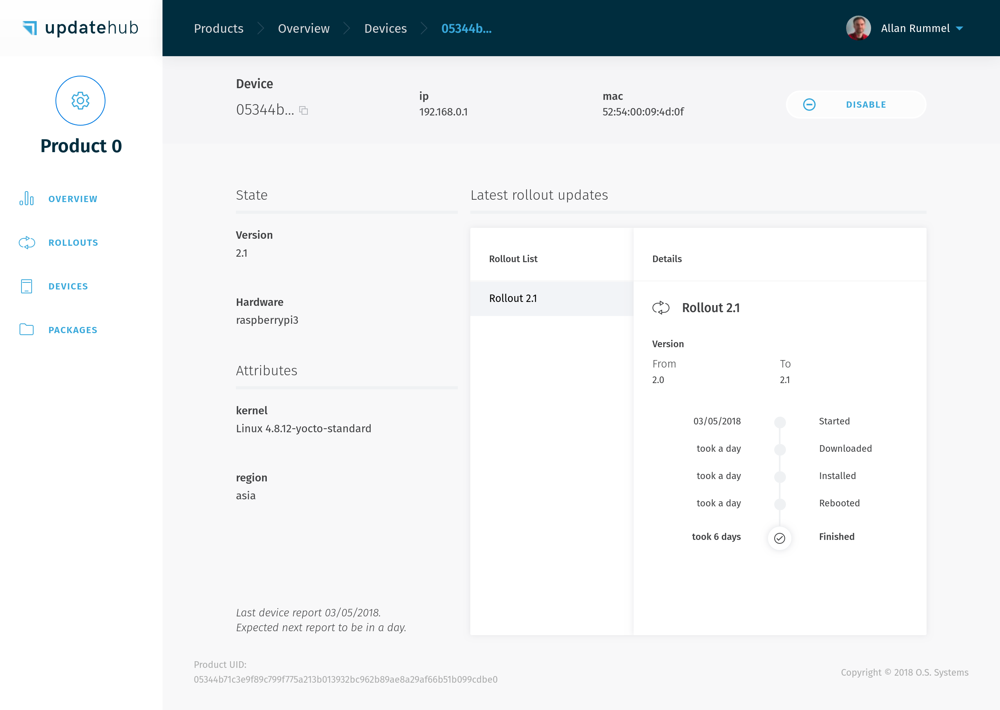
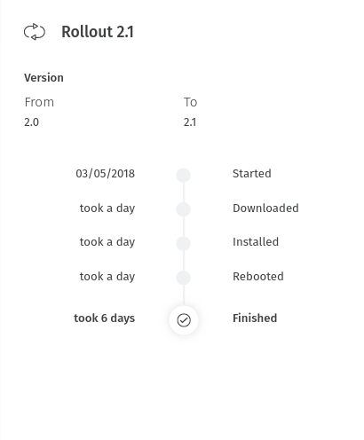
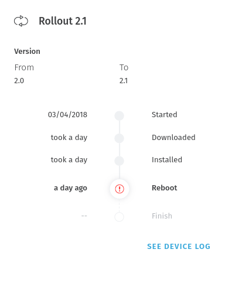
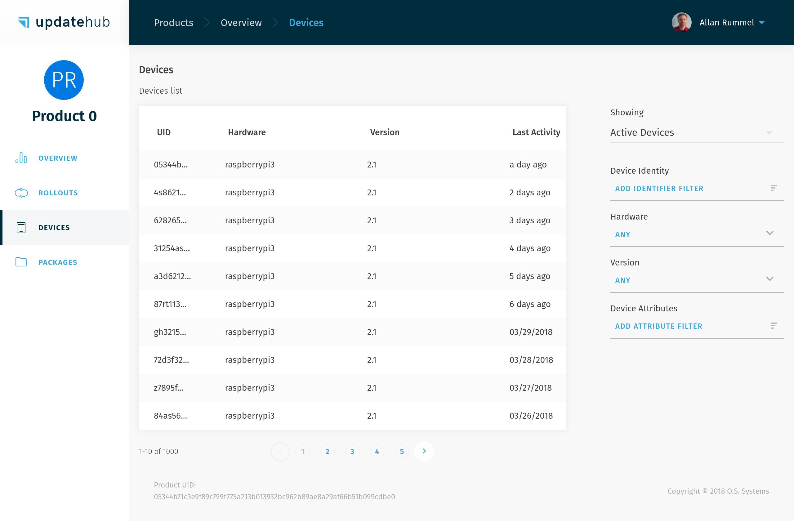

# Device 

The *Device* represents your physical device. It has multiple characteristics which are tracked on the management platform, as such: hardware type, unique identifier, runtime attributes and more.

The *Devices* page displays the list of registered devices for the *Product*.

## Include

For include device in your account, just put the correct variables in *build/conf/local.conf* before generate an image with **Yocto Project**.
The devides automatically connect in **UpdateHub** server which verify for update package. 
Optionally we can create a *RSA* Key for add security in comunication.  

## Details

The *Device Details* page provides you access to detailed information about a specific *Device* such as:

- The *Unique Identifier* (UID)
- The device identity values (e.g. MAC* address, CPU serial number or other)
- Current installed package version
- Hardware model
- Device state (enabled or disabled)
- Device attributes

Besides the device information, the *Rollout* history of the device allow an easy access to the current and previous device's update status, such as duration, logs about errors and date of the events.



During a normal situation the device *Rollout* will be displayed showing the moment that started, going through all the process until the point that is finished, like in the image below:



In the case of some kind of problem happens during the update process, the **UpdateHub** will provide a visual feedback of the moment it occured. To examine the failure you need to select *See Device Log*.



This data about the device ensures the user has all information needed for any upcoming situation, being capable of manage his devices within the entire *Product* lifetime.

## List

The **UpdateHub** allows the selection of *Devices* to be displayed on the list through the use of filters, therefore granting the user excellent capacity for organization even when managing a great number of them at once. The user has the option to filter *Devices* by their status as active or inactive, identity values, hardware, package version and custom attributes.



## Checking out

If to check if the *Rollout* worked and the device is up to date you just need type in your device the command below.

```
cat /etc/os-release
```

And it will show the version you use in the *Rollout*.