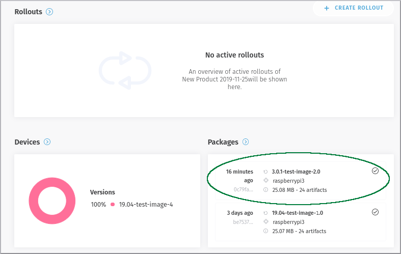
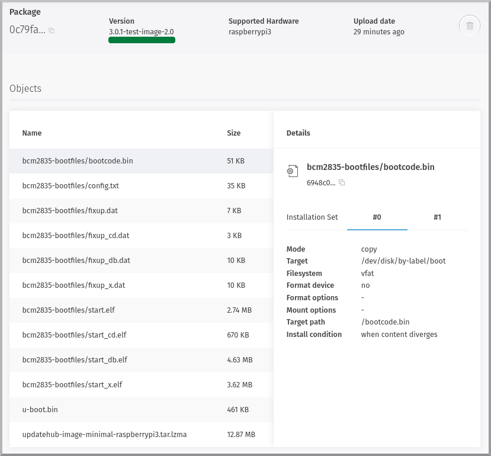

# Package

A software version, including the filesystem image, bootloader or any other objects, is represented by a *Package*.  Is a update package that are put in server and wait the command for init the update process. Them take a specifid format and are generate after modifications for patchs or features aditions in original image.

In dashboard, the *Package* is available after you join in a specific *Product*.

## Package Details

In the *Package Details* page the user may have a deeper look into a particular *Package* and its information.

Beyond the information already present on the *Package List*, you will find more data about the *Objects* and their details which is used by the **UpdateHub** agent during the object's installation.

Once you entered in the *Package Details* you have the option to remove the package from the *Rollout* if necessary by clicking on the *trash can* icon. The package will be visible and accessible but won't be available anymore.

## Package List

The *Packages* page, in the same fashion of the *Devices* page, exhibit a list with information about the packages inside a specific *Product* the user selected, such as:

- *Package Unique Identifier* (UID)
- Version
- Supported hardware list
- Status
- Size
- Upload date

Each one of these items help the user find a specific package. To filter more efficiently the packages you can select and associate them by the following items during the search:

- Status of each package can be found depending on the situation for the *Rollout*
  - *Available*: the package is ready to be downloaded
  - *Upload in Progress*: package during the uploaded process
  - *Removed*: packages that were removed from the packages list
  - *Pending Progress*: packages being checked by the server
  - *Packages with Error*: packages that failed the system checksum
- Version for the package
- Supported hardware

## Rollout 

In *Rollout* page we may have acess to update package information as well. Look at the image below. 

If you like you can see details of the *Package* just clicking on the version information.

