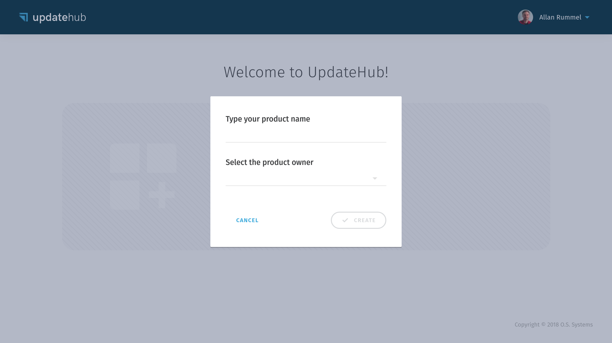
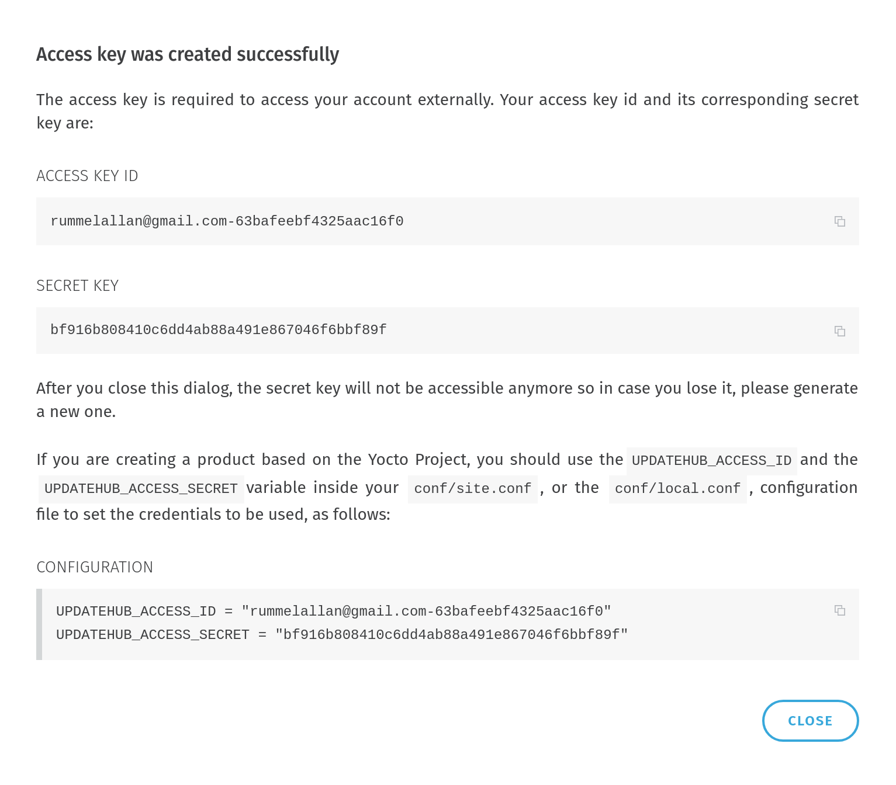

# Product

The basis that connects all together through the **UpdateHub** is the *Product*. Essentially the *Product* includes one or multiple *Devices* and for each of them there is a *Package* version that may be updated using a *Rollout*

## Creating a product 

After you login in [UpdateHub](https://auth.updatehub.io/auth/login/) in the *Products* page click *Add Product*.


By doing that the following dialog will be displayed. 



You should choose a *Product* name and who will have control over it by choosing  *Owner* (*Me* or a *Organization*) of the product. Bear in the mind that after you create a product you can not deleted it, so have sure you are choosing the correct owner.

!!! warning "Important"
	If you want to create a *Product* that you will use in a single job, just select the product owner as *Me*, but remember that you can not transfer the *Products* to the organization or vice versa.



After the *Product* has been created a *Unique Identifier Number* is generated to identify it. This number, should be added to your build in order to allow the **UpdateHub** agent, which runs inside the target device, to communicate with the **UpdateHub Cloud**.

For convenience, you can add the *UPDATEHUB_PRODUCT_UID* to your  *build/conf/local.conf* configuration file when prototyping. However, as this is a information that will be permanent for the whole product life cycle, it should be put inside your distribution configuration file, or image recipe.

The *UPDATEHUB_PRODUCT_UID* will be shown to you when you create your product inside the management server. It will look as:

```
UPDATEHUB_PRODUCT_UID = "05344b71c3e9f8..."
```
After you press the *OK* button you will be into the *Products* screen where you can see all your *Product*, *Rollouts*, *Devices* and *Packages*.


If you make changes in your product and send this changes to your **UpdateHub** the package will be appear in the *Package List*.

## Details

Once you have logged in, the *Products* page will display the list of your own products and the other products you have access to.


Clicking on any product card, you will be taken to the *Product Overview* page. In this page you find useful information about the *Product*, as which *Devices* you have deployed on the field, the two last *Packages* sent for that particular *Product* and the *Rollouts* status.

In case you didn't copy the *Product Unique Identifier Number* in the moment that you create it on the **UpdateHub Cloud** don't worry. To get access to this information again you must click on the *Product* icon and the *Unique Identifier Number* will be shown to you.

