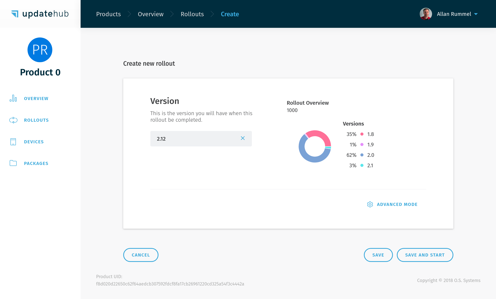
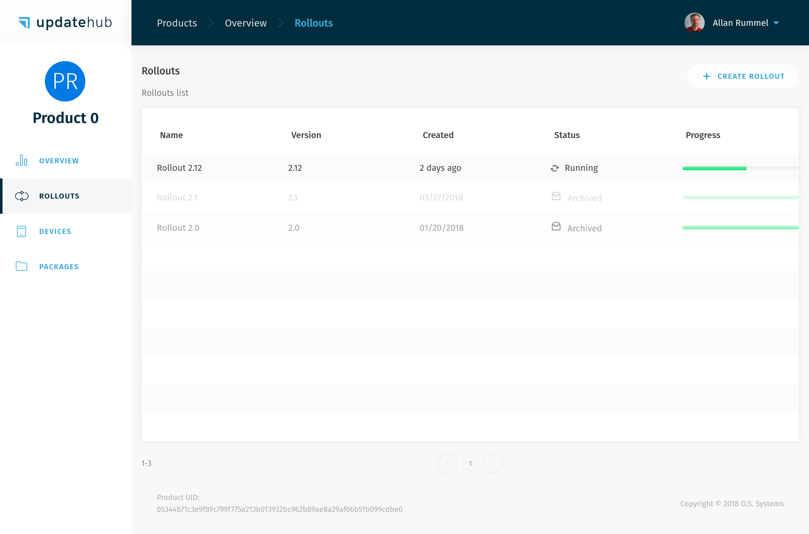

# Rollout

The *Rollout* is the process of deploying a specific version of your software, a *Package*, to a set of *Devices*. It can be simple as "send version 2.0 for all devices" or complex selecting specific filters and enforcing a gradual deployment across the devices set. 

All the process happens over-the-air (OTA) and can update a great number of *Devices* effortlessly.

## Creating 

There are two methods to execute the *Rollout*.

The simpler way shows all the versions of the *Devices* present on the field to be updated at once.

You just need to go to the *Overview* or *Rollouts* page and click on *Create Rollout*. A box to choose the *version* will appear. After you make this choice just click on *Save* to initiate the *Rollout* later or *Save and Start* launch it straightaway.

Keep in mind that this method will trigger the *Rollout* for all the *Devices* accessible for the *Product* chosen, with no restrictions concerning the different hardware or other aspects of the fleet on the field. 

The other way is to select which equipment receives the *Rollout* the **UpdateHub** offers the *Advanced mode* option. 

## Advanced mode

Whenever you need more control over the *Rollout* of a several *Devices* at once use the option *Advanced Mode*. 

A *Task* will be automatically generated and you can use the filters offered by the **UpdateHub** for select the *Devices*. We indicate to use *Fault Tolerance* percentage because this safe measure. The **UpdateHub** will abort the *Rollout* automatically if the failure rate goes over the threshould specified, providing a safe and fast update plan for your necessities.

The *Devices*  can filter by their Version, Hardware, Device Identifier (e.g: the MAC address) and Device Attributes (e.g: kernel version, device total memory). With multiple *Tasks* define the policy to begin new update processes by setting the starting point when a selected percentage of it is reached and the user can set if it must begin automatically or manually. Finally *Save* the *Rollout* to start later or *Save and Start* it immediately.

It is important to bear in mind that you can create as many *Tasks* as possible as long there is *Devices* available for the *Rollout* and choose names for each individual *Task* in order to organize and identify them.

## Rollout Details

The **UpdateHub** also gives all the information with the details of each specific *Rollout*, allowing a complete overview of the individual process. Among the information displayed inside the *Rollout Details* you will find:

- *Version*: the version of *Rollout* that the *Device* will receive.
- *Creation Date*: the date that the *Rollout* was created.
- *Tasks*: this area shows the each task that is part of the *Rollout*. Each task includes a number of information, such as:
    - *Number of Devices*: all the *Devices* available for the *Rollout*, including the number of process concluded, failed, and remaining in one or various tasks are displayed here.
    - *Fault tolerance*: that's the percentage limit of failures which can occur during the *Rollout* until the **UpdateHub** aborts the running rollout process, including any pending tasks.
- *Play/Pause Rollout*: whenever the user wants to play or pause the *Rollout* the option is available, unless the process is aborted or the user chooses to archive it.
- *Archive the Rollout*: once the rollout is not necessary anymore it can be archived and stopped definitely.

## List

The *Rollout List* exhibit every *Rollouts* available for the *Product* chosen and a brief information about them, such as name, version, creation, status and progress.

