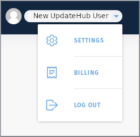

# Settings

At the *Settings* menu you will find the your information, and you will be able to manage your *Account*, the *Aplication Access*, as well as manage the *Organizations* you belongs to.

Sign in your account and go to settings screen by clicking on the drop down menu on the right of your name and select *Settings*.  

- *Account*: includes the user name and e-mail address.
- *Application Access*: contains different keys to access your data or a organization specific data.
- *Organizations*: a space for all the organizations that the user participates.

## Account

Here you can edit your data or add and remove e-mail. 

## Applications access

To authenticate and authorize requests for a project build with the **UpdateHub** you must have a security credential in the form of an application access key. Each access key is specific to your user and is used to upload the packages update or any other external integration which needs to access the **UpdateHub** API.

### Creating an Access Key

In order to generate an *Access Key* you must enter the *Settings* menu and click on the *+ Request Access Key* button. Choose a name for the key and select the API Key owner as *Me* or a *Organization*.

Once the access key is created a dialog will appear to show the security credentials. 
!!! danger "Attention"
	On the moment that this window is closed the keys will not be showed again and if you lose them you must revoke the Access Key and generate a new one.

## Organization

In addition to the *Access Key* created for the user to work individually, the **UpdateHub** grants the possibility of more than one user to have acess to the same *Product*.

### Creating an Organization

Create an *Organization* is simple, as you just need to click on the *+ Create Organization* button and select a name for it. You will be automatically be set as *Owner*. After the creation of an *Organization* invitations for new members can be easily sent. The invite must contain the user's e-mail and the level of access allowed to him.

There are three users access levels inside the *Organization*, each one with a particular set of permissions:
- *Owner* - has all the permissions to normally create products, start rollouts and invite other members for the *Organization*;
- *Release Manager* - limited to manage the rollouts;
- *Developer* - has the permission to only create the packages.

Each *Organization* will display a list with all of its members, showing their name, e-mail address, access level of permission, and a list with all the pending invites waiting to be answered.